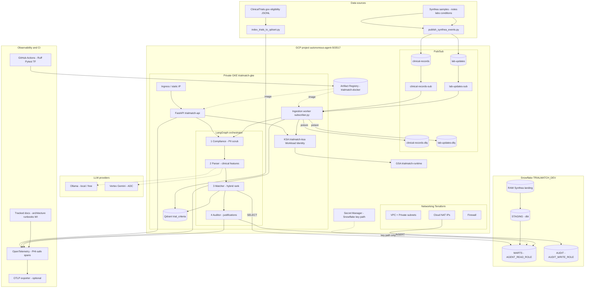

# Autonomous Clinical Trial Matching & Patient Cohort Discovery Engine

Enterprise event-driven system for clinical trial matching and patient cohort discovery on **GCP** and **Snowflake**, with multi-agent workers (LangGraph) on Private GKE.

## System architecture

End-to-end view of every major component (data → ingress → agents → stores → ops).



### Component map

| Layer | Components |
|-------|------------|
| **Sources** | Synthea samples, ClinicalTrials.gov eligibility, publisher + indexer scripts |
| **Ingress paths** | FastAPI (`POST /v1/match`) and Pub/Sub → ingestion worker (same LangGraph) |
| **Agents** | Compliance → Parser → Matcher → Auditor (fail-closed) |
| **LLM** | Ollama (default, $0 tokens) or Vertex Gemini (ADC / Workload Identity) |
| **Vectors** | In-cluster Qdrant (`trial_criteria`) |
| **Warehouse** | Snowflake RAW → dbt STAGING/MARTS; AUDIT append-only |
| **Identity** | `trialmatch-ksa` → `trialmatch-runtime@…` (no SA JSON keys) |
| **Platform** | VPC, NAT, firewall, private GKE, Artifact Registry, Secret Manager, Ingress |
| **Ops** | OpenTelemetry (allowlisted attrs), GitHub Actions CI, tracked `docs/` |

More detail: [docs/architecture.md](docs/architecture.md) · [docs/security/workload-identity.md](docs/security/workload-identity.md)

## LangGraph agent pipeline

Locked graph order used by FastAPI `POST /v1/match` (and later Pub/Sub ingestion). Any node failure sets `status=failed` and short-circuits to **END** (fail-closed).


| Node | Agent | Role |
|------|--------|------|
| **Compliance** | Agent 1 | Scrub PHI → `scrubbed_text`, `content_hash`, redaction tokens |
| **Parser** | Agent 2 | LLM JSON → validated `PatientFeatures` |
| **Matcher** | Agent 3 | Hybrid rank trials (`AGENT_READ_ROLE` only) |
| **Auditor** | Agent 4 | PII-free justification → `AUDIT_WRITE_ROLE` append-only rows |

```text
Clinical note → Compliance → Parser → Matcher → Auditor → ranked matches + audit record
```

## Local development

### Prerequisites

- **Python 3.10+** (OpenTelemetry floor; Dev Container uses 3.11)
- [VS Code Dev Containers](https://code.visualstudio.com/docs/devcontainers/containers) (recommended) **or** local pip

### Bootstrap

```bash
# Host (once): ADC for GCP / Terraform
gcloud auth application-default login

# Dev Container (recommended): Cursor → Dev Containers: Reopen in Container
# Uses Anysphere Dev Containers + Docker Desktop; mounts %APPDATA%\gcloud as ADC
make test
gcloud config get-value project   # autonomous-agent-503517

# Local without container (Windows example with 3.10):
py -3.10 -m pip install -e ".[dev]"
py -3.10 -m pytest
cp .env.example .env   # set GCP_PROJECT_ID=autonomous-agent-503517
```

### Coding standards

1. **TDD** — write `test_*` first, then implementation.
2. **Local README rule** — every code file `X` has a gitignored companion `X.README.md`.
3. **Local learning guides** — phase-wise file explanations live in gitignored `doc/` (start at `doc/README.md`).
4. **Zero hardcoded secrets** — ADC / Workload Identity only.
5. **Pre-commit hooks** — `make pre-commit-install` once; commits run Ruff/Terraform fmt; pushes run pytest (see [CONTRIBUTING.md](CONTRIBUTING.md)).

See [CONTRIBUTING.md](CONTRIBUTING.md).

## Phase status

| Phase | Status |
|-------|--------|
| 0 Project Setup & DevContainer | Complete |
| 0.5 Data Sources (Synthea + ClinicalTrials.gov) | Complete |
| 1 Shared Contracts & Config | Complete |
| 1.5 OpenTelemetry Tracing Skeleton | Complete |
| 2 Terraform VPC & Networking | Complete |
| 3 Private GKE, IAM & Workload Identity | Complete |
| 4 Pub/Sub, Ingress & Secret Manager IAM | Complete |
| 5 Snowflake RBAC, Network Policy & dbt | Complete |
| 6 Qdrant Vector Store & Embeddings | Complete |
| 7 Agent 1: Compliance (PII Scrub) | Complete |
| 8 Agent 2: Parser (Clinical Feature Extraction) | Complete |
| 9 Agent 3: Matcher (Snowflake + Qdrant Hybrid) | Complete |
| 10 Agent 4: Auditor (Justifications & Audit Logs) | Complete |
| 11 LangGraph Orchestrator + FastAPI | Complete |
| 12 Ingestion (Pub/Sub → Orchestrator) | Complete |
| 13 CI/CD (GitHub Actions) | Complete |
| 14 Integration, Observability & Tracked Docs | Complete |

## Deploy / onboarding

**New to the project?** Start here (clone → bastion → Snowflake → Ollama/Qdrant → working `/v1/match`, including troubleshooting we hit along the way):

→ **[Getting started: end-to-end live path](docs/guides/getting-started-live-path.md)**

## Data loading (Snowflake + Qdrant)

### Current demo corpus (keep it simple)

| Store | What is loaded | Scale (approx) |
|-------|----------------|----------------|
| **Snowflake** `RAW` / `MARTS` | SyntheticMass / Synthea HF dump (patients, conditions, observations→labs) via prepare + PUT/COPY + `dbt run` | ~1.6M patients, tens of millions of mart features |
| **Qdrant** `trial_criteria` | ClinicalTrials.gov studies matching **`diabetes` + `RECRUITING` only** | **~1,953 trials** |

We intentionally keep the Qdrant index at **~2k recruiting diabetes trials** for a simple, relevant demo. That is **not** all of ClinicalTrials.gov (400k+ studies). Wider corpora are optional below.

Committed tiny fixtures remain under `data/synthea/samples/` and `data/clinicaltrials/samples/` for unit tests. Bulk files live under gitignored `data/raw/`.

### Snowflake — Synthea / SyntheticMass → `RAW`

```bash
# 1) Project HF CSVs into slim landing files ( --limit 0 = all valid patients )
python -u scripts/prepare_synthea_for_snowflake.py --limit 0

# 2) PUT + COPY into RAW.RAW_SYNTHEA_* (uses .env keypair; ACCOUNTADMIN by default)
python scripts/put_copy_synthea_to_snowflake.py --truncate

# 3) Build STAGING / MARTS
cd dbt && dbt run && cd ..
```

Requires Snowflake keypair env (`SNOWFLAKE_ACCOUNT`, `SNOWFLAKE_USER`, `SNOWFLAKE_PRIVATE_KEY_PATH`) and dbt profile (`~/.dbt/profiles.yml`). See [getting-started live path](docs/guides/getting-started-live-path.md) Part D.

### Qdrant — index trials (current ~2k set)

Qdrant runs in-cluster. From the Dev Container you need a double tunnel:

1. **Bastion:** `kubectl -n trialmatch port-forward svc/qdrant 6333:6333`
2. **Dev Container:** SSH local forward to that port:

```bash
gcloud compute ssh trialmatch-bastion \
  --project=autonomous-agent-503517 \
  --zone=us-central1-a \
  --tunnel-through-iap \
  -- -N -L 6333:127.0.0.1:6333
```

3. Verify, then index:

```bash
curl -sS -m 5 http://127.0.0.1:6333/readyz   # expect: all shards are ready

# Fetch recruiting diabetes studies (default --max-studies 0 = all pages for this query)
python -u scripts/fetch_clinicaltrials_eligibility.py \
  --query "diabetes" \
  --status RECRUITING \
  --max-studies 0

python scripts/index_trials_to_qdrant.py \
  --sample-path data/raw/clinicaltrials/eligibility.jsonl \
  --live
```

Upserts are **batched** (avoids Qdrant’s ~32MB request body limit). Expect `{'indexed': ~1953}` for the recruiting-diabetes corpus.

### Optional — load *more* trials into Qdrant

Only do this when you want a larger search space (more time, storage, and noisier neighbors).

| Goal | Command hints | Approx CT.gov size |
|------|----------------|--------------------|
| Keep demo simple (default) | `--query "diabetes" --status RECRUITING` | ~2k |
| All diabetes (any status) | `--query "diabetes" --status "" --max-studies 0` | ~24k |
| T2D recruiting only | `--query "type 2 diabetes" --status RECRUITING` | ~0.9k |
| T2D any status | `--query "type 2 diabetes" --status "" --max-studies 0` | ~12k |

Example — expand to all diabetes statuses, then re-index:

```bash
# tunnels must be up (readyz OK)

python -u scripts/fetch_clinicaltrials_eligibility.py \
  --query "diabetes" \
  --status "" \
  --max-studies 0

python scripts/index_trials_to_qdrant.py \
  --sample-path data/raw/clinicaltrials/eligibility.jsonl \
  --live

curl -sS http://127.0.0.1:6333/collections/trial_criteria   # check points_count
```

`--max-studies 0` means **paginate until CT.gov has no more pages** for that query/filter (not “entire CT.gov”). Pulling the full registry (all conditions) is out of scope for the default path.

Related scripts: `scripts/prepare_synthea_for_snowflake.py`, `scripts/put_copy_synthea_to_snowflake.py`, `scripts/fetch_clinicaltrials_eligibility.py`, `scripts/index_trials_to_qdrant.py`. See also [data/README.md](data/README.md).

## Doctor demo (Streamlit)

Private **demo UI** for clinicians/guests: login → pick a preset patient/note → call GKE `POST /v1/match` → render ranked trials. Matching stays on the backend; Streamlit only submits and displays.

```bash
# 1) API tunnel (bastion port-forward + optional SSH -L 18080 from Dev Container)
# 2) Guest secrets
mkdir -p .streamlit
cp streamlit_app/secrets.toml.example .streamlit/secrets.toml
# edit DEMO_GUEST_USERNAME / DEMO_GUEST_PASSWORD

pip install -r streamlit_app/requirements.txt
streamlit run streamlit_app/app.py --server.address 0.0.0.0 --server.port 8501
```

Details: [streamlit_app/README.md](streamlit_app/README.md).

## Deployed infra outputs (dev)

Captured from `terraform apply` in `infra/terraform/envs/dev` (project `autonomous-agent-503517`). Refresh anytime with `terraform output`.

| Output | Value |
|--------|--------|
| Cluster | `trialmatch-gke` (private endpoint `172.16.0.2`; access via [IAP bastion](docs/runbooks/bastion-access.md)) |
| Registry | `us-central1-docker.pkg.dev/autonomous-agent-503517/trialmatch-docker` |
| Runtime GSA / KSA annotation | `trialmatch-runtime@autonomous-agent-503517.iam.gserviceaccount.com` |
| NAT IPs (Snowflake later) | `136.112.132.174`, `34.61.252.214` |

## Package

Python package: `trialmatch` (`src/trialmatch`), version `0.1.0`.
