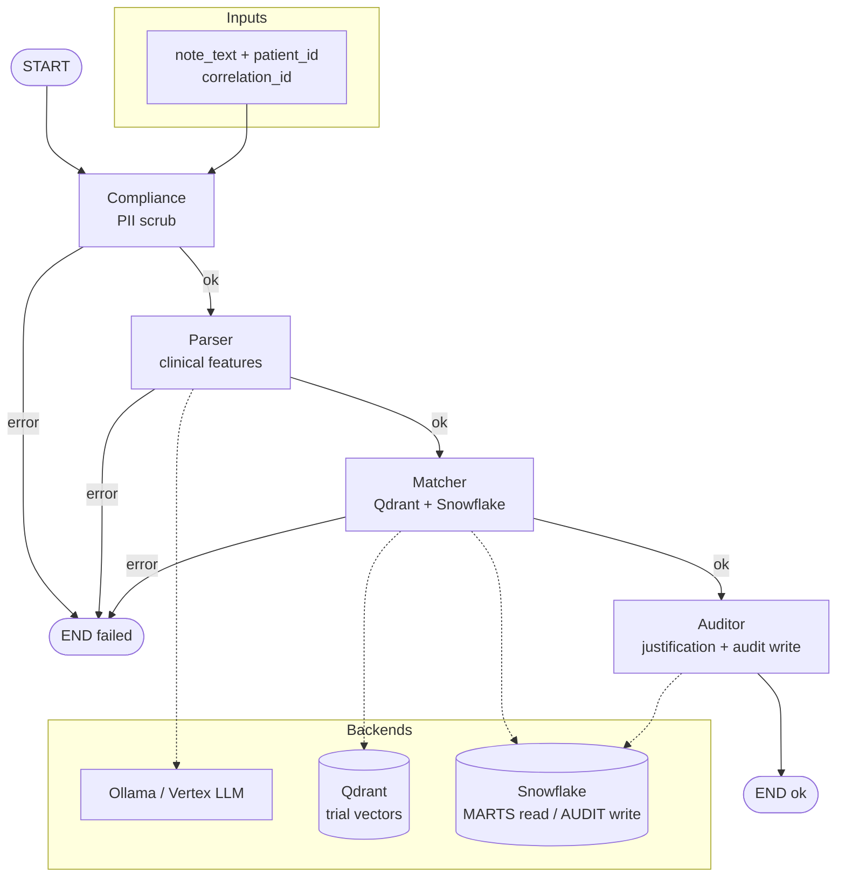

# Autonomous Clinical Trial Matching & Patient Cohort Discovery Engine

Enterprise event-driven system for clinical trial matching and patient cohort discovery on **GCP** and **Snowflake**, with multi-agent workers (LangGraph) on Private GKE.

## System architecture

End-to-end view of every major component (data → ingress → agents → stores → ops).

```mermaid
flowchart TB
  subgraph sources [Data sources]
    SYN[Synthea samples<br/>notes / labs / conditions]
    CTG[ClinicalTrials.gov<br/>eligibility JSONL]
    PUBLISH[publish_synthea_events.py]
    INDEX[index_trials_to_qdrant.py]
  end

  subgraph gcp [GCP project autonomous-agent-503517]
    subgraph net [Networking — Terraform]
      VPC[VPC + Private subnets]
      NAT[Cloud NAT<br/>136.112.132.174<br/>34.61.252.214]
      FW[Firewall]
    end

    subgraph messaging [Pub/Sub]
      T_CLIN[(clinical-records)]
      T_LAB[(lab-updates)]
      DLQ_C[(clinical-records-dlq)]
      DLQ_L[(lab-updates-dlq)]
      SUB_C[clinical-records-sub]
      SUB_L[lab-updates-sub]
    end

    subgraph gke [Private GKE — trialmatch-gke]
      KSA[KSA trialmatch-ksa<br/>Workload Identity]
      ING_API[Ingress / static IP]
      API[FastAPI trialmatch-api<br/>/healthz /readyz /v1/match /docs]
      WORKER[Ingestion worker<br/>subscriber.py]
      QDR[(Qdrant<br/>trial_criteria)]

      subgraph graph [LangGraph orchestrator]
        C[1 Compliance<br/>PII scrub]
        P[2 Parser<br/>clinical features]
        M[3 Matcher<br/>hybrid rank]
        A[4 Auditor<br/>justifications]
        C --> P --> M --> A
      end
    end

    AR[(Artifact Registry<br/>trialmatch-docker)]
    SM[Secret Manager<br/>Snowflake key path]
    GSA[GSA trialmatch-runtime]
  end

  subgraph llm [LLM providers]
    OLLAMA[Ollama — local / free]
    VERTEX[Vertex Gemini — ADC]
  end

  subgraph snowflake [Snowflake TRIALMATCH_DEV]
    RAW[(RAW Synthea landing)]
    STG[(STAGING — dbt)]
    MARTS[(MARTS<br/>AGENT_READ_ROLE)]
    AUDIT[(AUDIT<br/>AUDIT_WRITE_ROLE)]
  end

  subgraph obs [Observability and CI]
    OTEL[OpenTelemetry<br/>PHI-safe spans]
    OTLP[OTLP exporter — optional]
    GHA[GitHub Actions<br/>Ruff · Pytest · TF validate]
    DOCS[docs/ architecture<br/>runbooks · WI]
  end

  SYN --> PUBLISH --> T_CLIN
  SYN --> PUBLISH --> T_LAB
  CTG --> INDEX --> QDR
  T_CLIN --> SUB_C --> WORKER
  T_LAB --> SUB_L --> WORKER
  WORKER -->|poison| DLQ_C
  WORKER -->|poison| DLQ_L

  ING_API --> API
  API --> graph
  WORKER --> graph
  KSA --> GSA
  API --> KSA
  WORKER --> KSA
  AR -.->|image| API
  AR -.->|image| WORKER

  P -.-> OLLAMA
  P -.-> VERTEX
  M --> QDR
  M -->|SELECT| MARTS
  A -->|INSERT| AUDIT
  RAW --> STG --> MARTS
  SM -.->|key path only| MARTS
  NAT --> snowflake

  API --> OTEL
  WORKER --> OTEL
  graph --> OTEL
  OTEL --> OTLP
  GHA --> AR
  DOCS --- gke
```

### Component map

| Layer | Components |
|-------|------------|
| **Sources** | Synthea samples, ClinicalTrials.gov eligibility, publisher + indexer scripts |
| **Ingress paths** | FastAPI (`POST /v1/match`) and Pub/Sub → ingestion worker (same LangGraph) |
| **Agents** | Compliance → Parser → Matcher → Auditor (fail-closed) |
| **LLM** | Ollama (default, $0 tokens) or Vertex Gemini (ADC / Workload Identity) |
| **Vectors** | In-cluster Qdrant (`trial_criteria`) |
| **Warehouse** | Snowflake RAW → dbt STAGING/MARTS; AUDIT append-only |
| **Identity** | `trialmatch-ksa` → `trialmatch-runtime@…` (no SA JSON keys) |
| **Platform** | VPC, NAT, firewall, private GKE, Artifact Registry, Secret Manager, Ingress |
| **Ops** | OpenTelemetry (allowlisted attrs), GitHub Actions CI, tracked `docs/` |

More detail: [docs/architecture.md](docs/architecture.md) · [docs/security/workload-identity.md](docs/security/workload-identity.md)

## LangGraph agent pipeline

Locked graph order used by FastAPI `POST /v1/match` (and later Pub/Sub ingestion). Any node failure sets `status=failed` and short-circuits to **END** (fail-closed).



| Node | Agent | Role |
|------|--------|------|
| **Compliance** | Agent 1 | Scrub PHI → `scrubbed_text`, `content_hash`, redaction tokens |
| **Parser** | Agent 2 | LLM JSON → validated `PatientFeatures` |
| **Matcher** | Agent 3 | Hybrid rank trials (`AGENT_READ_ROLE` only) |
| **Auditor** | Agent 4 | PII-free justification → `AUDIT_WRITE_ROLE` append-only rows |

```text
Clinical note → Compliance → Parser → Matcher → Auditor → ranked matches + audit record
```

## Local development

### Prerequisites

- **Python 3.10+** (OpenTelemetry floor; Dev Container uses 3.11)
- [VS Code Dev Containers](https://code.visualstudio.com/docs/devcontainers/containers) (recommended) **or** local pip

### Bootstrap

```bash
# Host (once): ADC for GCP / Terraform
gcloud auth application-default login

# Dev Container (recommended): Cursor → Dev Containers: Reopen in Container
# Uses Anysphere Dev Containers + Docker Desktop; mounts %APPDATA%\gcloud as ADC
make test
gcloud config get-value project   # autonomous-agent-503517

# Local without container (Windows example with 3.10):
py -3.10 -m pip install -e ".[dev]"
py -3.10 -m pytest
cp .env.example .env   # set GCP_PROJECT_ID=autonomous-agent-503517
```

### Coding standards

1. **TDD** — write `test_*` first, then implementation.
2. **Local README rule** — every code file `X` has a gitignored companion `X.README.md`.
3. **Local learning guides** — phase-wise file explanations live in gitignored `doc/` (start at `doc/README.md`).
4. **Zero hardcoded secrets** — ADC / Workload Identity only.
5. **Pre-commit hooks** — `make pre-commit-install` once; commits run Ruff/Terraform fmt; pushes run pytest (see [CONTRIBUTING.md](CONTRIBUTING.md)).

See [CONTRIBUTING.md](CONTRIBUTING.md).

## Phase status

| Phase | Status |
|-------|--------|
| 0 Project Setup & DevContainer | Complete |
| 0.5 Data Sources (Synthea + ClinicalTrials.gov) | Complete |
| 1 Shared Contracts & Config | Complete |
| 1.5 OpenTelemetry Tracing Skeleton | Complete |
| 2 Terraform VPC & Networking | Complete |
| 3 Private GKE, IAM & Workload Identity | Complete |
| 4 Pub/Sub, Ingress & Secret Manager IAM | Complete |
| 5 Snowflake RBAC, Network Policy & dbt | Complete |
| 6 Qdrant Vector Store & Embeddings | Complete |
| 7 Agent 1: Compliance (PII Scrub) | Complete |
| 8 Agent 2: Parser (Clinical Feature Extraction) | Complete |
| 9 Agent 3: Matcher (Snowflake + Qdrant Hybrid) | Complete |
| 10 Agent 4: Auditor (Justifications & Audit Logs) | Complete |
| 11 LangGraph Orchestrator + FastAPI | Complete |
| 12 Ingestion (Pub/Sub → Orchestrator) | Complete |
| 13 CI/CD (GitHub Actions) | Complete |
| 14 Integration, Observability & Tracked Docs | Complete |

## Deployed infra outputs (dev)

Captured from `terraform apply` in `infra/terraform/envs/dev` (project `autonomous-agent-503517`). Refresh anytime with `terraform output`.

| Output | Value |
|--------|--------|
| Cluster | `trialmatch-gke` (private endpoint `172.16.0.2`) |
| Registry | `us-central1-docker.pkg.dev/autonomous-agent-503517/trialmatch-docker` |
| Runtime GSA / KSA annotation | `trialmatch-runtime@autonomous-agent-503517.iam.gserviceaccount.com` |
| NAT IPs (Snowflake later) | `136.112.132.174`, `34.61.252.214` |

## Package

Python package: `trialmatch` (`src/trialmatch`), version `0.1.0`.
