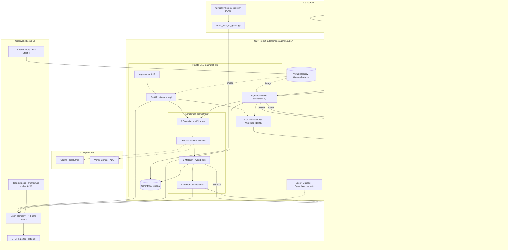

# TrialMatch Architecture

Operator-facing overview of the Autonomous Clinical Trial Matching & Patient Cohort Discovery Engine.

## Purpose

Match synthetic/EPR clinical notes to ClinicalTrials.gov-style eligibility using a fail-closed multi-agent pipeline on GCP + Snowflake.

## Data sources

| Source | Role |
|--------|------|
| **Synthea** | Synthetic patients, labs, conditions, clinical notes (dev/prototype) |
| **ClinicalTrials.gov** | Trial eligibility text → Qdrant vectors |

## Full system diagram



## Runtime pipeline (compact)

```text
Pub/Sub (clinical-records) ──► Ingestion worker
                                    │
FastAPI POST /v1/match ─────────────┤
                                    ▼
                    LangGraph (fail-closed)
         Compliance → Parser → Matcher → Auditor
                    │            │          │
                    │            ├─ Qdrant (vectors)
                    │            └─ Snowflake MARTS (AGENT_READ_ROLE)
                    └─ Snowflake AUDIT (AUDIT_WRITE_ROLE)
```

| Agent | Responsibility | Privileges |
|-------|----------------|------------|
| Compliance | PHI scrub + content hash | In-process only |
| Parser | LLM → structured features | Ollama (local) or Vertex (ADC) |
| Matcher | Hybrid rank trials | Snowflake **read**, Qdrant search |
| Auditor | Justification + append-only audit | Snowflake **AUDIT write** only |

## Deploy topology (dev)

| Component | Value |
|-----------|--------|
| GCP project | `autonomous-agent-503517` |
| Private GKE | `trialmatch-gke` (endpoint `172.16.0.2`) |
| Namespace / KSA | `trialmatch` / `trialmatch-ksa` |
| Runtime GSA | `trialmatch-runtime@autonomous-agent-503517.iam.gserviceaccount.com` |
| Artifact Registry | `us-central1-docker.pkg.dev/autonomous-agent-503517/trialmatch-docker` |
| NAT IPs (Snowflake allowlist) | `136.112.132.174`, `34.61.252.214` |
| Pub/Sub | `clinical-records`, `lab-updates` (+ DLQs) |

IaC: `infra/terraform/envs/dev`. Workloads: `k8s/api`, `k8s/ingestion`, `k8s/qdrant`.

## Observability

- OpenTelemetry via `trialmatch.observability.tracing`
- Span attributes are **allowlisted** (no note text, SSN, MRN, email, etc.)
- Configure `OTEL_EXPORTER_OTLP_ENDPOINT` to export to a collector / Cloud Trace

## Related docs

- [Workload Identity](security/workload-identity.md)
- [Matching incident runbook](runbooks/incident-matching.md)
- Root [README.md](../README.md) (pipeline mermaid + phase status)
